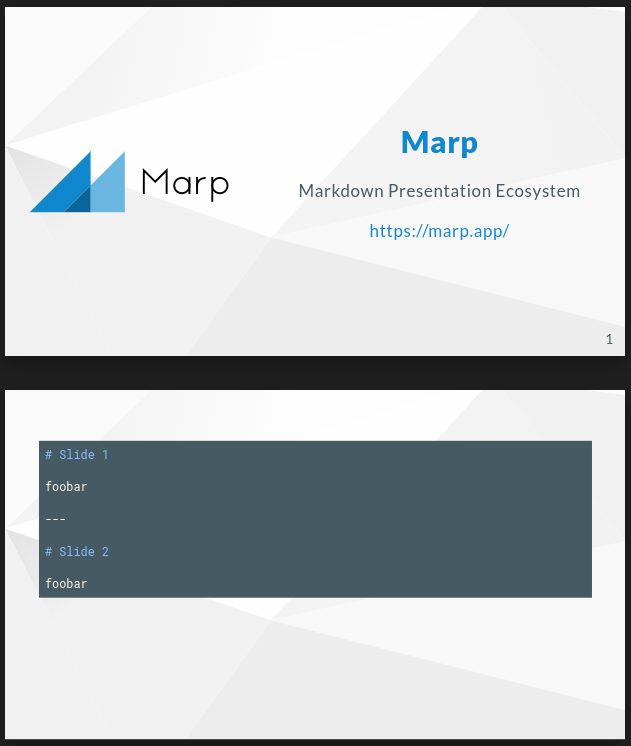

<!-- style>
:root {
    font-family: "Calibri", "Segoe UI";
    --shp-text-headings: #042d58;
    --shp-text-body: #1e1e1e;
    --shp-text-body-secondary: #808080;
    --shp-text-link: #3093ef;
    --shp-bg-brand-primary: #011e41;
    --shp-text-headings-onbrand: #fafafa;
    --shp-text-size-header: 24px;
    --shp-text-size-footer: 18px;
}
section {
    background: #fff no-repeat url("assets/logo.png");
    background-position: top right;
    background-size: 180px;
    color: var(--shp-text-body);
}
h1,h2,h3,h4,h5,h6 {
    color: var(--shp-text-headings);
}
h1 {
    text-align:center;
}
a {
    color: var(--shp-text-link);
    text-decoration: underline;
}
header {
    color: var(--shp-text-headings);
    font-size: var(--shp-text-size-header); 
}
footer {
    border-top:1px solid var(--shp-text-body-secondary); 
    width:95%; 
    padding-top: 10px; 
    color: var(--shp-text-body-tertiary);
    font-size:var(--shp-text-size-footer);
}
section::after {
  color: var(--shp-text-body-tertiary);
  padding-right: 10px;
  font-size:var(--shp-text-size-footer);
}

section.cover header,
section.cover footer { display:none}
section.cover {
    /*background: #fff no-repeat url("assets/logo-cover.png");*/
    background-position: 50% 10%;
    background-size: 700px;
}
section.cover h1 {
    background-color: var(--shp-bg-brand-primary);
    color: var(--shp-text-headings-onbrand);
    padding-block: 1rem;
    position: relative;
    width: 100%;
    z-index: 1;
    margin: 300px 0 30px;
    font-weight: normal;
    font-size: 50px;
}
section.cover h2 {
    text-align: center;
    margin-block:0;
    font-size: 28px;
}
section.cover h3 {
    text-align: center;
    margin-block:0;
    font-weight: normal;
    font-size: 28px;
}

/* classi custom presentazione */
.container { display: flex; }
.col { flex: 1; }
.col13 { flex: 1; padding:1em; }
.col23 { flex: 2; padding:1em; }
.col14 { flex: 1; padding:1em; }
.col34 { flex: 3; padding:1em; }
p { line-height:1.1em; }
.img { height:100%;text-align:center;position:relative;line-height:100%; }
.img img {
    vertical-align:middle;
/*
    max-width:100%;
    max-height:100%;
    width:100%;
    height:100%;
*/
    margin:auto;
}
li { line-height: 1.2em; font-size:0.9em; padding-top:0.1em; }
td { padding: 0;line-height:1.1em; }
th { font-size:0.9em;line-height:1.1em; }
</style -->

<!-- _class: cover -->
# Slide in PowerPoint? no grazie
## ...preferisco scrivere in markdown

---

### Cos'è Markdown?
- è un linguaggio di markup leggero che consente di aggiungere formattazione a documenti di testo
- creato nel 2004 da John Gruber, attualmente è uno dei linguaggi di markup più popolari

---

### Perché usare Markdown?
- può essere usato per qualunque cosa: creazione siti web, documenti, appunti, libri, presentazioni, messaggi e-mail, documentazione tecnica
- è portatile: i file contenenti testo formattato con Markdown possono essere aperti virtualmente in ogni applicazione
- è indipendente dalla piattaforma: i file possono essere creati in qualunque sistema operativo
- è a prova di future modifiche ai software: se una applicazione in futuro non sarà più disponibile si potrà comunque aprire un file Markdown con un qualunque editor di testo
- è utilizzato ovunque, ad esempio su GitHub è il formato di default per i file README.md ed in tutti i testi di issues, pull request, etc.

---

### Slide decks in markdown? Si può fare!

- [https://marp.app](https://marp.app/) sostanzialmente è un convertitore di sintassi markdown in codice html/css per creare slide decks
- le presentazioni possono essere esportate in pdf, per essere poi utilizzate anche dove non si ha a disposizione Marp od un editor abilitato
- esiste estensione di VSCode per avere anteprima del risultato ed evidenziazione della sintassi
- l'aspetto grafico finale può essere personalizzato sia con temi preesistenti che con sezioni css all'interno del file stesso
- documentazione [https://marpit.marp.app/markdown](https://marpit.marp.app/markdown)

---

### Esempio minimale

- `front-matter` per direttive
- slides - markdown separato da `---`

```markdown
---
marp: true
theme: gaia
_class: lead
paginate: true
backgroundColor: #fff
backgroundImage: url('https://marp.app/assets/hero-background.svg')
---


# **Marp**

Markdown Presentation Ecosystem

https://marp.app/

---

# How to write slides

Split pages by horizontal ruler (`---`). It's very simple! :satisfied:

```markdown
# Slide 1

foobar
---

# Slide 2

foobar
```

